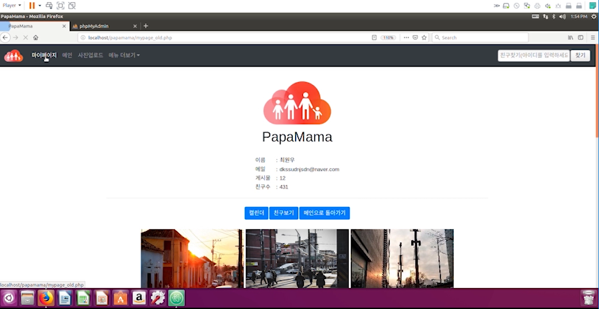
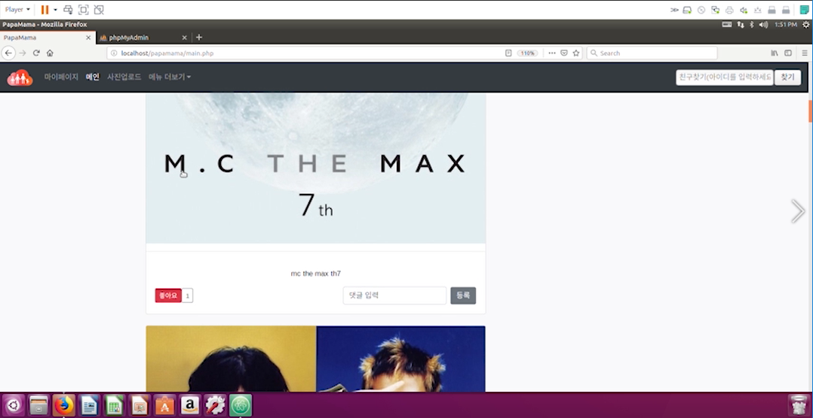

# PapaMama
### Family Album Service

### 프로젝트 소개
* 가족을 기반으로 사진을 공유할 수 있는 온라인 앨법 + SNS 서비스 입니다.
PHP 공부를 하면서 작성한 프로젝트입니다.
* MVC - Model1 방식으로 작성하였습니다.
### 기능
1. 로그인
2. 회원가입
3. 전체글보기
4. 사집 업로드
5. 마이앨범
6. 날짜별 사진 보기
7. 팔로우/언팔로우

### 제작정보
PHP를 사용하여 홈페이지를 제작하기위한 연습용 프로젝트입니다.
### 사용기술
* Linux(Ubuntu)
* PHP7
* Apache2
* MySQL5.7
* HTML/CSS
* Bootstrap4
* Javascript

### 필수조건 안내
* LAMP를 다른버전으로 사용했을 시 호환이 되지 않을  수 있습니다.
### 설치 안내 
1. 리눅스환경은 가상머신(VM Ware)을 사용했습니다.
2. Linux(Ubuntu) + Apache + PHP + MySQL 설치방법은 [https://webnautes.tistory.com/1185](https://webnautes.tistory.com/1185) 를 참고하시기 바랍니다.
3. LAMP 설치 후 cd /var/www/html 에 git의 파일들을 다운받습니다.
4. 코드의 MySQL 연결정보를 수정합니다.

### 실행방법

   - sudo service apache2 start 명령어를 통해 아파치를 구동시킵니다.
   - 웹브라우저에서 localhost/papamama/main.php 를 통해 메인페이지에 접속합니다.
* 
    

### 저작권
- CC0-1.0